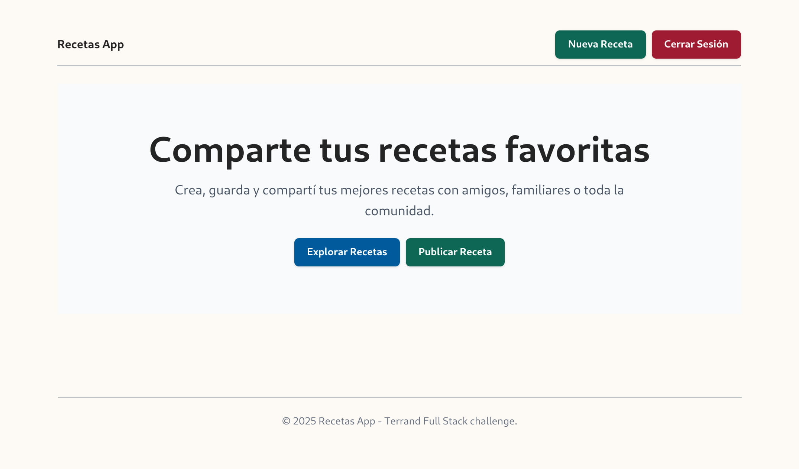
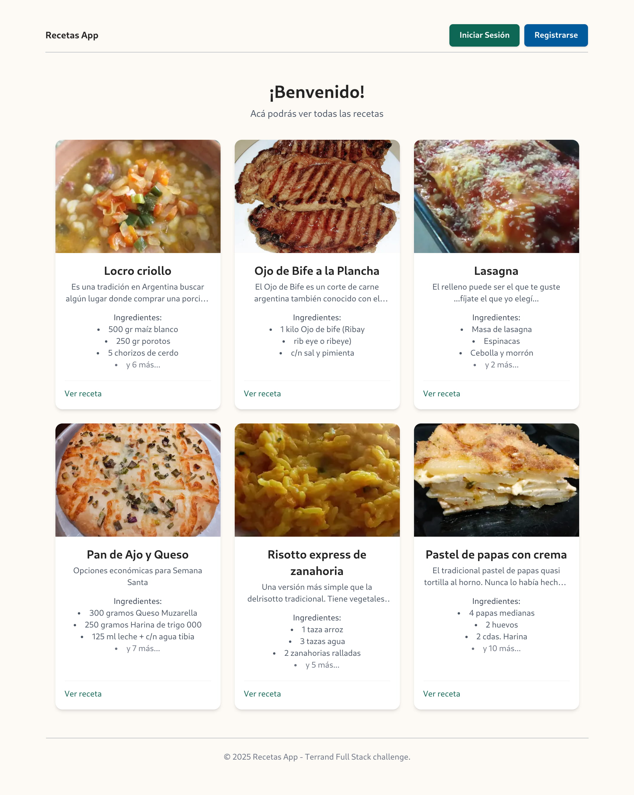
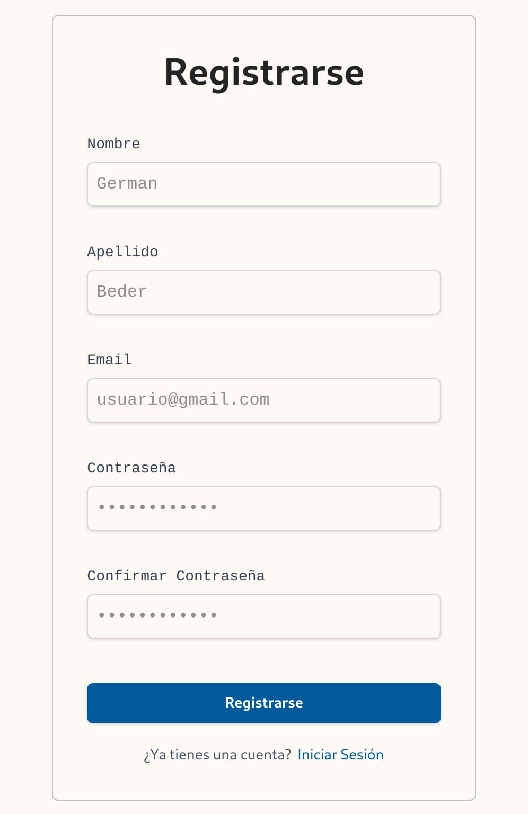
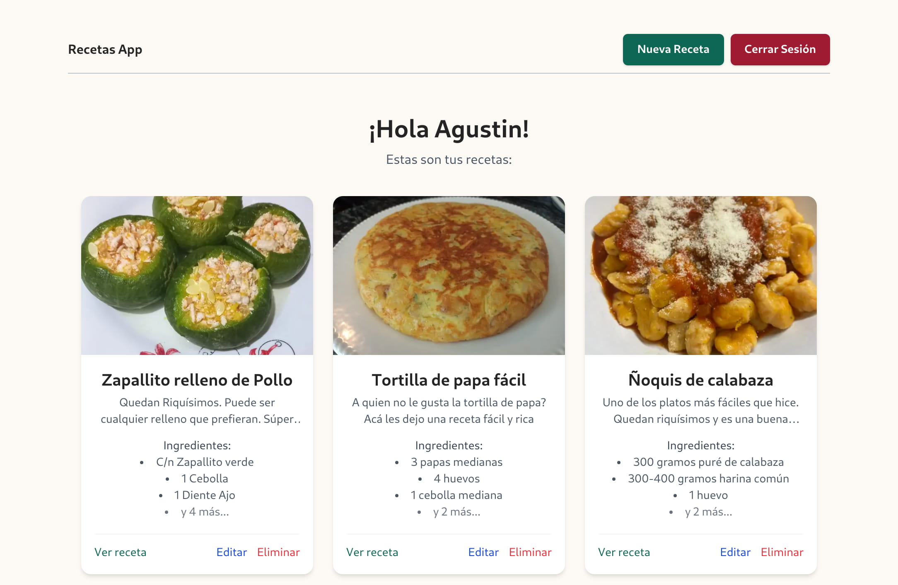
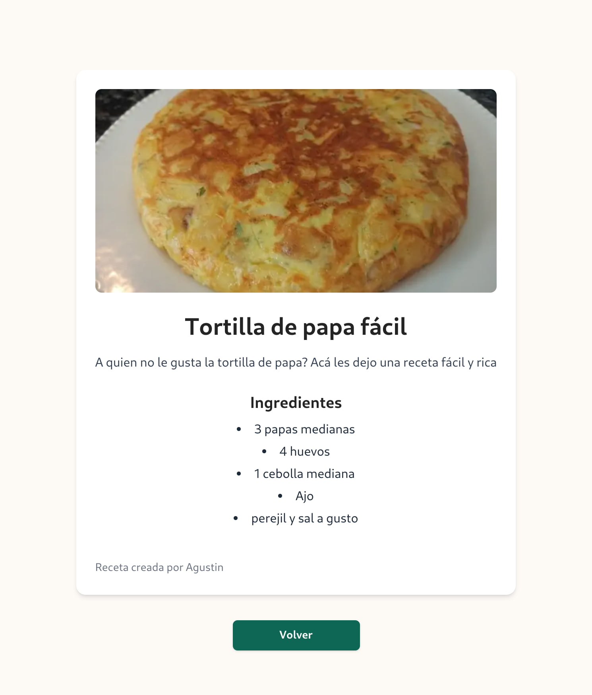
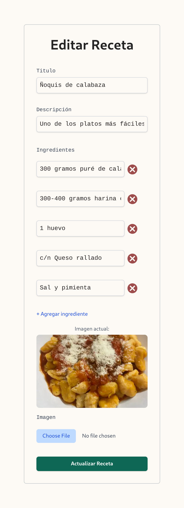

# Recipe App UI

Terrand Full-Stack challenge.

## Prerequisites

- [Node >= 18](https://github.com/nvm-sh/nvm) | This project was developed using node version `18.20.5`

## Project setup

```bash
$ npm install
```

## Environment variables

```bash
VITE_API_BASE_URL=
VITE_API_URL=
```

## Compile and run the project

```bash
$ npm run start
```

# About the challenge

Create an app where users can register and share recipes.

### Mandatory functional requirements completed

- [x] Registration with​ `Name`, `Last Name`, `Email`, `Password`, and `Repeat Password`.
- [x] Login with​ `Email` and `Password`.
- [x] Private section to see all my `recipes`, edit and create a new one.
- [x] A recipe must have at least: `Title`, `Description`, `Ingredients`.
- [x] The application must generate a public link where the recipe can be seen.

### Optional functional requirements completed

- [ ] Allow logged-in users to rate recipes.
- [x] Allow each recipe to upload an image.
- [ ] Publish your application (Deploy).

### Technical requirement completed

- [x] Use any JavaScript technology.

# Screenshots

- App demo video

Click [here](https://drive.google.com/file/d/1ZGcsqAUvnkqcTMzRPxOB7-777TIkRGYt/view?usp=sharing) to watch a video showcasing the app's features.

- Home



- All recipes



- Auth forms

|register|login|
|:-------:|:-----:|
|||

- Dashboard



- Recipe details



- Recipe forms

|update|create|
|:-------:|:-----:|
|||
